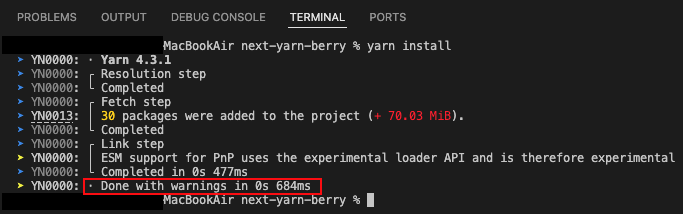
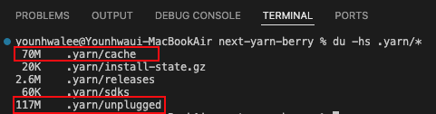
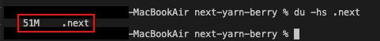
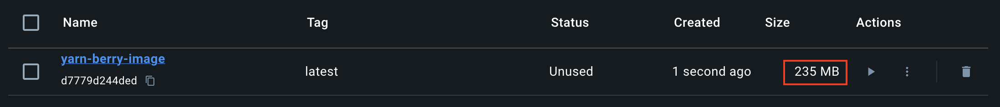
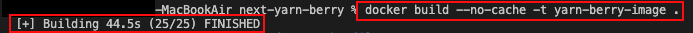
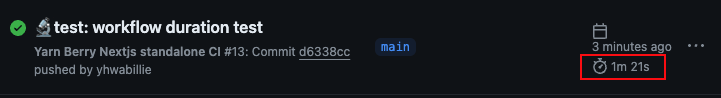
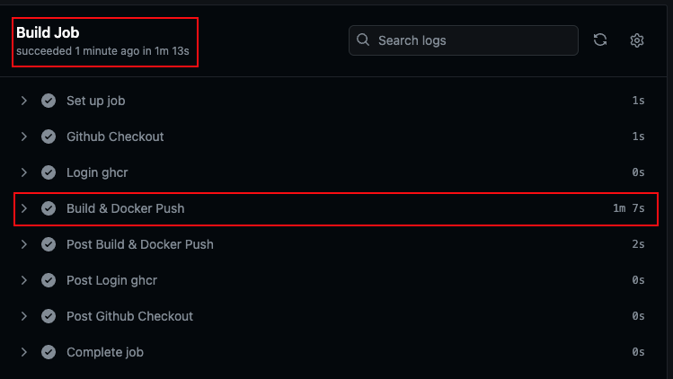

## :memo: Title: next-yarn-berry
패키지 매니저 `yarn berry v4.3.1`로 빌드한 NextJS 기본 템플릿입니다.  
nodeLinker로 `pnp` 방식으로 설정하였습니다. `zero-install 사용X`    
최초 빌드를 기준으로 하기위해 workflow 캐시 작업은 제외하였습니다.
<br/><br/>
#### 🚧 PnP 설정 사용시 VScode 환경 발생 에러 대처 (TypeScript, Prettier)
VScode에서 발생하는 "Module Not Found" 에러에 대처하기위해 VScode sdks를 설치하였습니다. 
```bash
yarn dlx @yarnpkg/sdks vscode
```
---
### 1) [🏠로컬] Dependency install 시간   
|결과: `684MS`|
|:------|
||
  

### 2) [🏠로컬] Dependency 크기   
|결과: `187M` (70M + 117M)|
|:------|
||
    

### 3) [🏠로컬] .next 빌드 결과물 크기  
|결과: `.next: 51M`|
|:------|
||   

### 4) [🐳Docker] 로컬 이미지 크기  
|결과: `235MB`|
|:------|
||

### 5) [🐳Docker] 로컬 이미지 build 시간 
|결과: `44.5s`|
|:------|
||

### 6) [⚡️Github Actions] CI total workflow 시간 
|결과: `1m 21s`|
|:------|
||

### 7-8) [⚡️Github Actions] Build Job, Build & Docker Push Step 시간 
|Build Job 결과: `1m 13s`, Build & Docker Push Step 결과: `1m 7s`|
|:------|
||

#### :mag: 위 조건들을 기준으로 패키지 매니저별 비교 학습하기 위해 만들었습니다.   
#### :mag: 대략적인 수치를 알기 위한 것으로, 오차가 있을 수 있습니다.

<br/><br/>

## :pushpin: Dev Enviroment
    Node (v20.11.1)  
    Yarn Berry (v4.3.1)  
    NextJS (v.14.2.5, output: standalone)    
    Docker (v.27.0.3)   
    Github Container Registry
    Github Actions Workflow

## :pushpin: Dev Dependencies
    prettier (v3)
